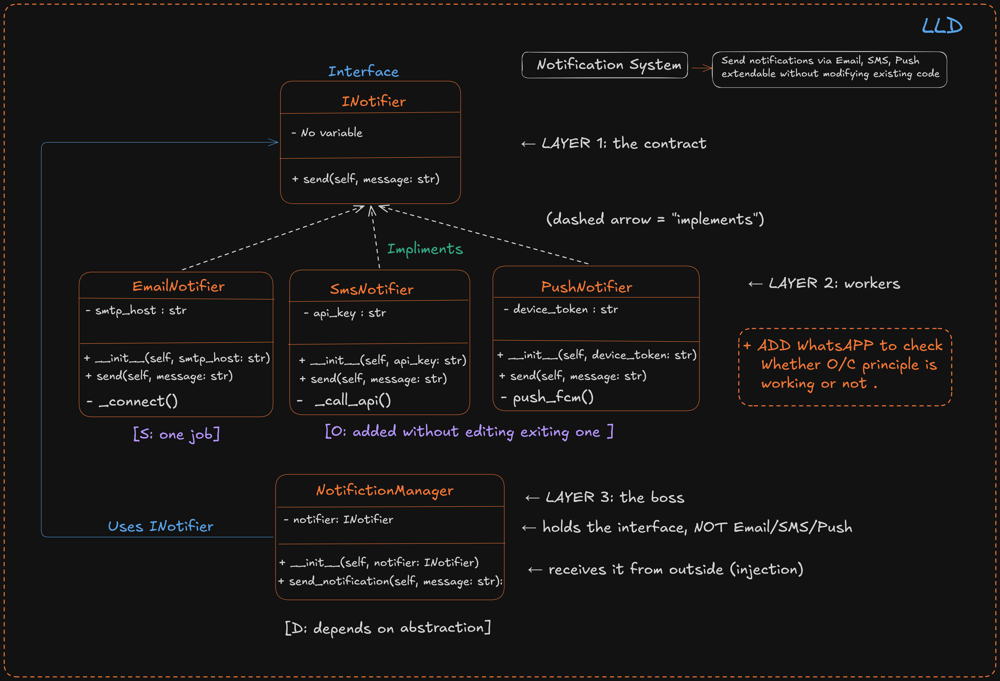

# 🔔 Notification System : SOLID Principles in Python

A beginner-friendly project that demonstrates **3 SOLID principles** (S, O, D) through a real-world notification system that sends messages via Email, SMS, Push, and WhatsApp.

Built as a learning project while studying Low Level Design (LLD).

---

## 📸 Class Diagram

<!-- Upload your class diagram image here -->
<!-- Replace the line below with your actual image after uploading to GitHub -->



---
## 🧠 SOLID Principles Applied

### S - Single Responsibility Principle
Each notifier class has **one job and one reason to change.**

- `EmailNotifier` → only knows how to send email
- `SmsNotifier` → only knows how to send SMS
- `PushNotifier` → only knows how to send push notifications
- `WhatsAppNotifier` → only knows how to send WhatsApp messages

If the SMS provider changes, only `SmsNotifier` changes. `EmailNotifier` is never touched.

---

### O - Open/Closed Principle
The system is **open for extension, closed for modification.**

When `WhatsAppNotifier` was added:
- ✅ Created one new class
- ❌ Did NOT touch `EmailNotifier`
- ❌ Did NOT touch `SmsNotifier`
- ❌ Did NOT touch `NotificationManager`

Adding a new channel = adding a new class. Nothing else.

---

### D - Dependency Inversion Principle
`NotificationManager` depends on the **abstraction** (`INotifier`), not on any concrete class.

```python
# NotificationManager never imports EmailNotifier or SmsNotifier
# It only knows about INotifier
class NotificationManager:
    def __init__(self, notifier: INotifier):  # ← abstraction, not concrete
        self.__notifier = notifier
```

You can swap Email for WhatsApp at runtime. The manager never breaks.

---

## 🏗️ Project Structure

```
notification-system/
│
├── notification_system.py   # main file with all classes
├── assets/
│   └── class_diagram.png    # upload your diagram here
└── README.md
```
---

## ▶️ Output

```
[SMS] OTP via SMS
└─ via key qwerty***

[EMAIL] OTP via Email
└─ via smtp.example.com

[PUSH] OTP via Push
└─ to device device_t...

[WHATSAPP] OTP via WhatsApp
└─ to +91 98765 43210
```

---

## 🚀 How to Run

```bash
# Clone the repo
git clone https://github.com/YOUR_USERNAME/notification-system-solid.git
cd notification-system-solid

# Run (no dependencies needed, pure Python)
python notification_system.py
```

---

## 📚 What I Learned

- How to define an abstract interface using Python's `ABC`
- Why `INotifier` sits between the manager and the concrete classes
- How adding a new channel (WhatsApp) without touching old code *feels* — and why that matters in production
- The difference between depending on an abstraction vs depending on a concrete class

---

## 🔮 What's Next

- Project 2: **Payment Processing System** —> demonstrating Liskov Substitution (L) and Interface Segregation (I)

---

## 👤 Author

**Dev** : Semester 6, ADIT, CVM University  
Learning LLD and building toward production-grade systems.

---

## 📄 License

MIT License - free to use, learn from, and share.